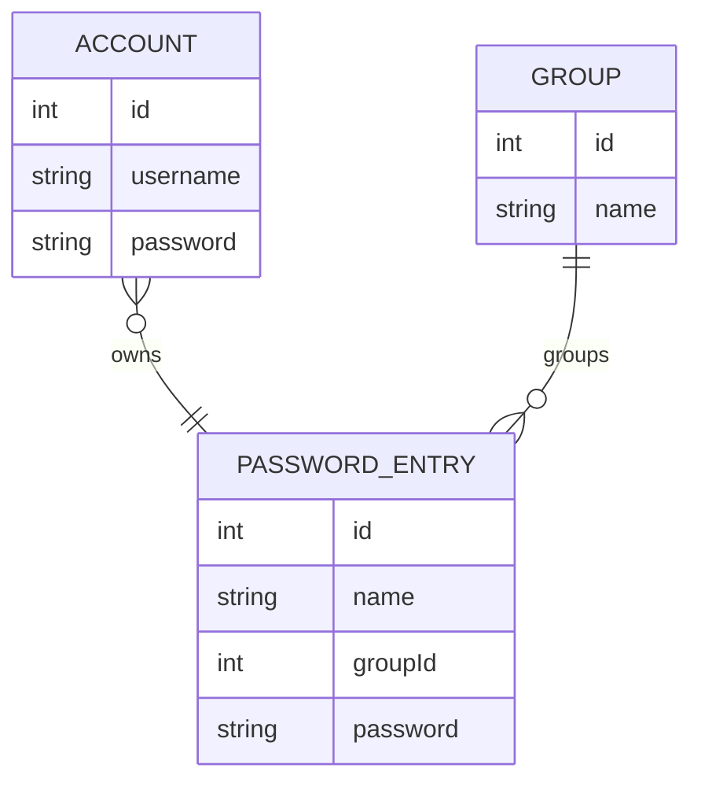

# Dokumentation

## 1 Anforderungsspezifikation

### Grundlegende App Übersicht

- App zur sicheren Speicherung und Verwaltung von persönlichen Passwörtern
- Bietet Filtereinstellungen zum suchen von Passwörtern
- Passwörter in Ordnern gruppieren um die Passwörter immer sortiert zu halten
- Ermöglicht das erstellen und verwalten von lokalen Nutzeraccounts
- Bietet Funktionalitäten zum erstellen von sicheren und zufälligen Passwörtern

### User stories (Nutzersicht)

- (U1) Ich benötige die Möglichkeit einen oder mehrere lokale Nutzeraccounts mit Nutzernamen und Generalpasswort erstellen zu können
- (U2) Bei App-Start möchte ich alle auf dem Gerät registrierten Accounts angezeigt bekommen
- (U3) Bei App-Start möchte ich einen registrierten Account auswählen können, um mich in diesen Einzuloggen
- (U4) Nach erfolgreicher Registrierung soll sich die App im Passworttresor befinden
- (U5) Die App sollte eine einfache Navigation zwischen Passworttresor, Einstellungen und Passwortgenerator besitzen
- (U6) Die App soll meine Initialen in der App anzeigen, damit ich weiß wer eingeloggt ist
- (U7) Ich möchte Passwörter in der App erstellen und diese verschiedene Gruppen zuordnen
- (U8) Passwörter müssen angepasst, gelöscht und in eine andere Gruppe sortiert werden können
- (U9) Der Passwortgenerator muss konfigurierbar sein und muss das erstelle Passwort in meine Zwischenablage legen, damit ich es an anderer Stelle einfügen kann
- (U10) Ich möchte volle Kontrolle über meinen Account haben, das heißt Verändern von Stammdaten, Löschen des Accounts

## 2 Modellierung

### Anwendungsfälle

### Entity Relationship Diagram

## 3 Ordnerstruktur